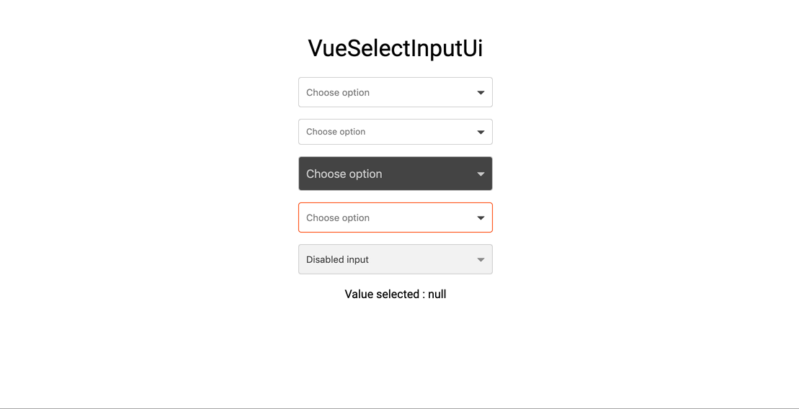

<!--  -->

# VueSelectInputUi

> A vue component for select dates (range mode available) & time



# Demo

[Enjoy](https://louismazel.github.io/vue-select-input-ui/)

# Installation

Yarn

```bash
yarn add vue-select-input-ui
```

NPM

```bash
npm i --save vue-select-input-ui
```

# Usage

## ES6 Modules / CommonJS

```js
import VueSelectInputUi from 'vue-select-input-ui';
import 'vue-select-input-ui/dist/vue-select-input-ui.css';

Vue.component('VueSelectInputUi', VueSelectInputUi);
```

```html
  <VueSelectInputUi
    v-model="yourValue"
    :options="[
      { label: 'First option', value: 'first' },
      { label: 'Second option', value: 'second' },
      { label: 'Third option', value: 'third' }
    ]"
  />
```

## UMD

```html
<link
  rel="stylesheet"
  type="text/css"
  href="${YOUR_PATH}/vue-select-input-ui.css"
/>

<div id="app">
  <VueSelectInputUi v-model="yourValue"></VueSelectInputUi>
</div>

<script src="https://unpkg.com/vue" charset="utf-8"></script>
<script
  src="${YOUR_PATH}/vue-select-input-ui.umd.min.js"
  charset="utf-8"
></script>

<script type="text/javascript">
  Vue.component('vue-select-input-ui', window['vue-select-input-ui']);
  new Vue({
    el: '#app',
    data() {
      return {
        yourValue: false
      };
    }
  });
</script>
```

# Props API

| Props                       | Type              | Required | Default                     |
| --------------------------- | ----------------- | -------- | --------------------------- |
| v-model                     | String            | yes      | -                           |
| id                       | String            | no       | VueSelectInputUi          |
| name                       | String            | no       | VueSelectInputUi          |
| label                       | String            | no       | Select option          |
| hint (1)                    | String            | no       | -                           |
| error (2)                   | Boolean           | no       | false                       |
| color (3)                   | String (hex)      | no       | dodgerblue                  |
| item-height (4)                      | Int            | no       | 30        |
| size                      | String ['sm', 'lg']           | no       | null        |
| disabled                   | Boolean           | no       | false                       |
| required                   | Boolean           | no       | false                       |
| dark                   | Boolean           | no       | false                       |
| valid                   | Boolean           | no       | false                       |
| validColor                   | String (hex)           | no       | false                       |
| options (5)                   | String (hex)           | no       | false                       |

(1) hint : Is a text that replaces the label/placeholder (Ex : Error designation)

(2) error : When is `true` --> Input border & label are red

(3) color: Replace color for the hint, the borders & picker color

(4) Height of items in option list

(5) Options should be an Array of object like that :

```js
[
  { label: 'First option', value: 'first' },
  { label: 'Second option', value: 'second' },
  { label: 'Third option', value: 'third' }
]
```
# Feature list

- You can search the option on taping the label
- Keyboard accessibilty
- Valid state ui
- Error state ui
- Message error state ui

# Events API

| Event           | Return                                            |
| --------------- | ------------------------------------------------- |
| input           | value (formatted with 'format' props)             |
| click | when you click on the component          |
| focus | when the component is focused         |
| blur | when the component is blur         |

# Keyboard Accessible

| Key            | Action                     |
| -------------- | -------------------------- |
| Arrow Down     | Next option      |
| Arrow Up       | Previous option  |
| Escape      | Close list |
| Enter | Select option                 |

# Upcoming features (Todo)

- Position list (left, right, top, bottom)

# Contribute

## Setting up development server

### Without Docker

Ensure you have Node and npm in your machine. Minimal config is:

- node >= 6.0
- npm >= 3.0

> This project is built with `node@10.x`.

Install the development dependencies by running:

```bash
npm install
```

or

```bash
npm ci # Recommanded if you have node > 10.x
```

Once your dependencies are installed, start the development server with:

```bash
npm run serve
```

This will start the development server available at `http://localhost:8080`.


## Compiles and hot-reloads for development

```bash
npm run serve
```

## Linter

```bash
npm run lint
```

## Tests

Work in progress

# License

This project is licensed under [MIT License](http://en.wikipedia.org/wiki/MIT_License)

